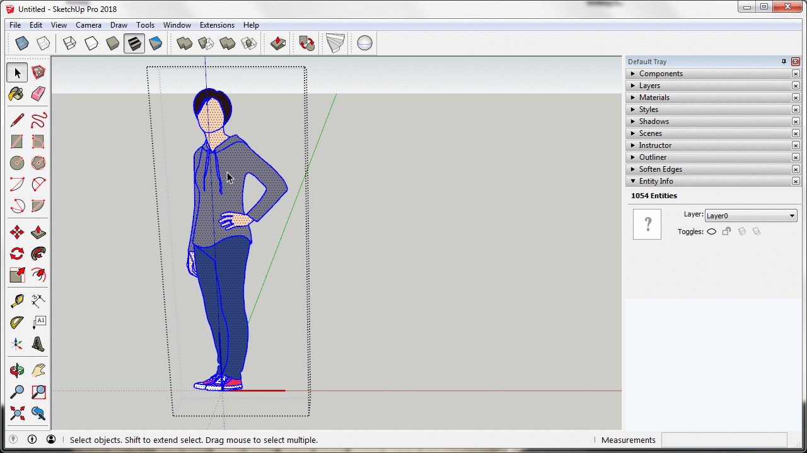

# Eneroth Random Selection

This extension was originally planned to be a Ruby Extension example but turned out to also be a rather useful little extension.

It is used to shrink the selection to a subset of the selected entities using a slider. One practical use case is to randomly select a subset of similar components to replace with another component. If you for instance have numerous identical trees in a model you can select them all, use this extension to shrink the selection to about half, and replace those with another differently looking tree component.
